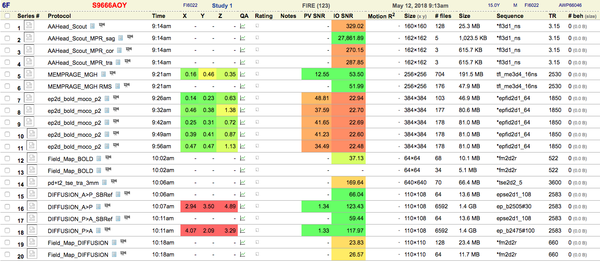
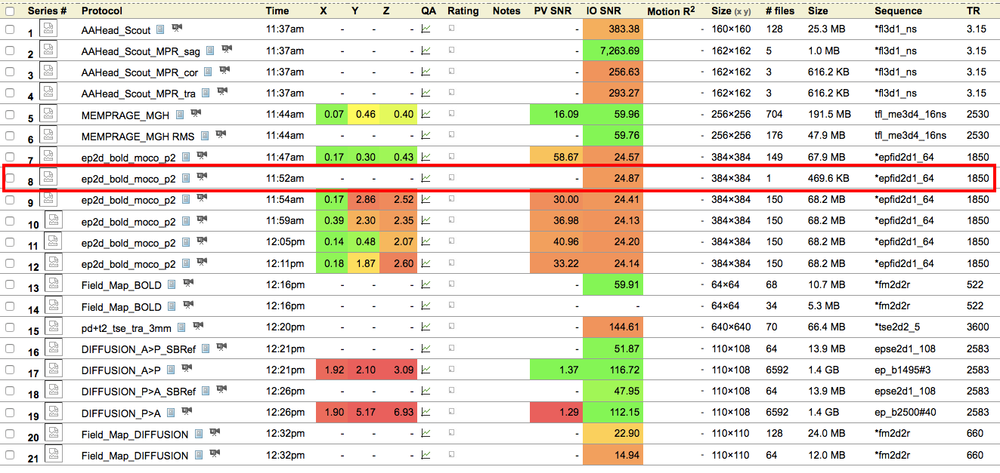
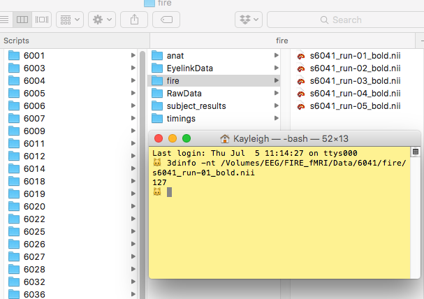
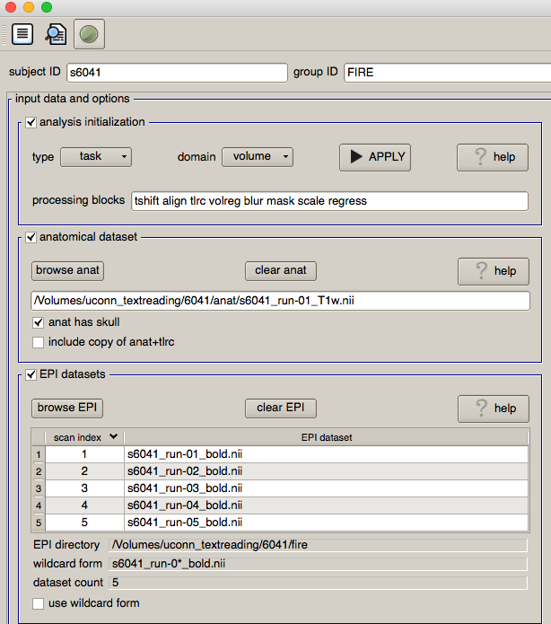
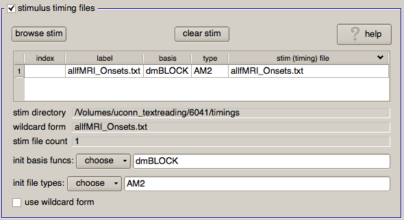
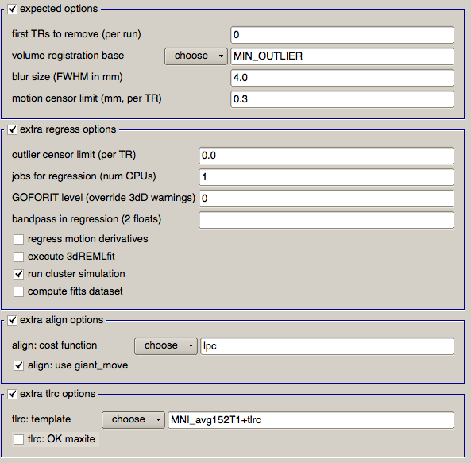

# FIRE Pre-processing

To preprocess data, you will need timing files and your MRI images.

## Acquiring MRI Data

All MRI data can be downloaded from the BIRC [Neuroinformatics Database](http://psypacs.psy.uconn.edu/nidb/index.php) (NiDB). Note that you must be on campus or on the [UConn VPN](http://remoteaccess.uconn.edu/) to access the NiDB. To learn more about navigating NiDB, see the [BIRC wiki](http://birc-int.psy.uconn.edu/wiki/index.php/NiDB_User_Guide) (must be on campus or VPN to access).

This section will provide FIRE-specific information about data stored in NiDB. To get to FIRE data:

1. Log into NiDB
2. Click "Search"
3. Select FIRE (123) from the "Project" drop-down menu and click "Search"

When you search for FIRE data, you will see something like the image below.  
 


Here you can see all of the scans run for each subject. Usually you will just see the regular 20 scans. This includes:

* 3D Localizer (1-4)
* anatomical file (MPRAGE; 5-6)
* 5 functional runs of the FIRE task (7-11)
* BOLD field map (12-13)
* high-resolution anatomical image (proton-density; 14)
* DWI (15-18)
* diffusion field map (19-20) 

Sometimes, there will be an error in running and there will be an abnormal number of scans. One thing to look out for is too many or too few functional scans. Take a look at this subject, for example.



If you look at Series #8, you will see that it is only 1 single image. It looks like it might be the last image from the last run, since the other functional runs have 150 images and the first run only has 149. Check the scan sheet PDF found in the subject directory to see if there are any notes about what may have happened. If there are enough images for all of the other functional runs, it may be a false start and you can not download that run (uncheck the box). Otherwise, check the box at the top, which will select all of the runs for a subject.

To download files, select the subjects you want to download. Then, use the following options.

* Download Type > Destination: Web
* Data: Imaging, Behavioral, QC
* Format: DICOM, Light DICOM anonymization, Gzip files
* Directory Structure > Directory Format: Primary alternate subject ID
* Directory Structure > Series Directories: Renumber series

To find your download file, click Search > Data request status. When your data is ready, you can click the download button to get it.

When you unzip the downloaded file, you will get individual folders for each of the subjects you chose to download. The folders will be labeled with the alternate ID -- this is the subject ID number that Elisa inputs at the beginning of the scan. (e.g., 6001FI).

On the server, create a folder with the subject number (e.g., 6001). Then create a folder inside of that one called RawData. Copy all of the series folders (1-20) from the download for a given subject to their RawData folder.

## Converting DICOM to NIFTI

fMRI data is stored in the main directory in subject-specific folder.. DICOM files are in RawData folders that are within each subject folder.

First, you will need to convert each subject's DICOM files to NIFTI format. Make sure you have MRIcro installed with the `dcm2nii` command in your path.

#### Installing `dcm2nii`

Follow the instructions on [this page](http://people.cas.sc.edu/rorden/mricron/dcm2nii.html) to download and install `dcm2nii`. Then you will have to add the program to your path.

1. Place the MRIcron folder that is inside the .dmg somewhere you want. I put it in my `abin` folder.
2. Go to your home directory: `cd`
3. Add the following lines to your `.bash_profile` by opening it in a text editor (e.g. `nano .bash_profile`). Change the `MRICRONDIR` to the path where your MRIcron folder is.

```
MRICRONDIR=$HOME/abin/MRIcron
PATH=${MRICRONDIR}:${PATH}
export MRICRONDIR PATH
```

#### Converting files

1. Navigate to the main directory.
2. Edit the file `subjList.txt` to include all of the subjects that you want to pre-process.
3. Execute the script `makeNIFTI.sh` by typing `sh makeNIFTI.sh`.


## Extracting Timing Information from DataViewer

Eyelink data is stored in the folder EyelinkDataAll. For each subject, you should create a folder in their subject folder called EyelinkData and copy their data into the folder. Each subject has 5 folders, one for each run of FIRE (e.g., for subject 6003, there are the subfolders 6003\_1, 6003\_2, 6003\_3, 6003\_4, and 6003\_5).


1. Open up DataViewer and click on File -> Import Data -> Multiple Eyelink Data Files, and select the folder containing all of the subfolders and click "Import" (e.g., `/Volumes/uconn_textreading/6001/EyelinkData`). This will load all of the fixation files, but not the area of interest files. The area of interest files are needed to determine which fixation corresponds to which word.

2. Within each trial for each run, click on the "Import Area of Interest" button, and load the corresponding Area of Interest (these AoIs are located in AreasOfInterest folder). Then, click on the trial, scroll down to the `Interest Area Set` field, and select the right interest area. This part is a little tedious! When you are done, save out the file as `<subjectNumber>_IndivEDFs`. Do **not** close the file.

3. Copy the script `extractScannerPulseTime.sh` into the Session_Data folder (which will be located in the <subjectNumber>_IndivEDFs.res folder). Navigate to that folder. Run it with `tcsh extractScannerPulseTime.sh`. (Note: You must be in `tcsh` to do this). This creates the file `scannerStartTimes.txt`, with the scanner onset time next to each run number.

4. Go back to your EDF files in DataViewer, and click on Analysis -> Trial Variable Manager. Click the little page icon to create a new variable. Under Label, enter `ScannerPulseTime`. Under Default Value, enter 0. Under Definition, enter "Time when scanner started." Select `ScannerPulseTime` in the list and use the arrow button to place it right below `scanrun`. Press OK.

5. Now set the `ScannerPulseTime` value for each subject. Select Analysis -> Trial Variable Value Editor. Open the scannerStartTimes.txt file, and copy the value under Onset into the corresponding ScannerPulseTime for each run. Press OK.

6. Export the data by clicking on Analysis -> Fixation Report and selecting the following variables:

* `RECORDING_SESSION_LABEL`
* `TRIAL_INDEX`
* `CURRENT_FIX_DURATION`
* `CURRENT_FIX_INTEREST_AREA_ID`
* `TRIAL_START_TIME`
* `CURRENT_FIX_START` 
* `ScannerPulseTime`
* `scanrun`

Save as `Onsets_<subjectNumber>.txt` into the `<subjectNumber>_IndivEDFs/<subjectNumber>_IndivEDFs.res` folder.


## Creating the Timing Files

First, you will need to create the subject/TR file that the script will read. For each subject that you want to make timing files for, you will need to put their number followed by a space and then the number of TRs in each run.

Type `3dinfo -nt ` and then drag any file from the `fire` folder in a participant's main folder into Terminal.



This will print out the number of TRs in a FIRE run for that subject. Go to the `timing_subjList.txt` file (in the main `Data` folder) and edit it in your favorite text editor. Paste the subject number and the number of TRs separated by a space, like below.

```
6036 152
6041 127
```
Save this file. Now you will actually create the timing files.

1. Navigate to the top Data directory using Terminal. `PATH_TO_DROBO/FIRE_fMRI/Data/`.
2. Navigate to the Scripts folder. `cd Scripts`
3. Type `sh make_timings.sh` to run the script.

Each subject that you make timing files for should now have a folder named `timings` with two files inside. One is for the regular analysis, and one for the NGRAM.

## Pre-processing

Use uber_subject.py to create an analysis script for each subject individually. See [the video](https://www.youtube.com/watch?v=5U97PV3-rZ0&feature=youtu.be) for a demonstration on how to do this for a sample subject. 

Here are some screenshots and information from another sample subject.



1. Enter `s` and then the subject number into `subject ID`. Set the `group ID` as FIRE.
2. Check the box for `analysis initialization`
3. Find your anatomical NIFTI image (should be in the `anat` folder).
4. Find your functional NIFTI images.



5. Add the `allfMRI_Onsets.txt` file you generated.
6. Change the basis function to `dmBLOCK` by typing it into the field.
7. Choose `AM2` for `init file types`.



8. Check extra regress options and change the `jobs for regression` if you have multiple CPUs.
9. Check extra align options. Change the cost function to `lpc` and check the `use giant_move` box.
10. Check the extra tlrc options and choose the MNI template.

Once you’ve run the analysis for the `allfMRI_Onsets.txt` file, you can run Deconvolve on the same data with the NGRAM timings.

1. Copy the `doDecon_NGRAM.sh` script from the Scripts folder into the newly created folder that contains all of the processed data and statistics (`subject_results`). 
2. Copy the NGRAM timing file `allfMRI_Onsets_NGRAM.txt` into the stimuli directory.
3. The script takes the subject name as an argument; e.g., `tcsh doDecon_NGRAM.sh s6001`. Also make sure to  before running the script.
